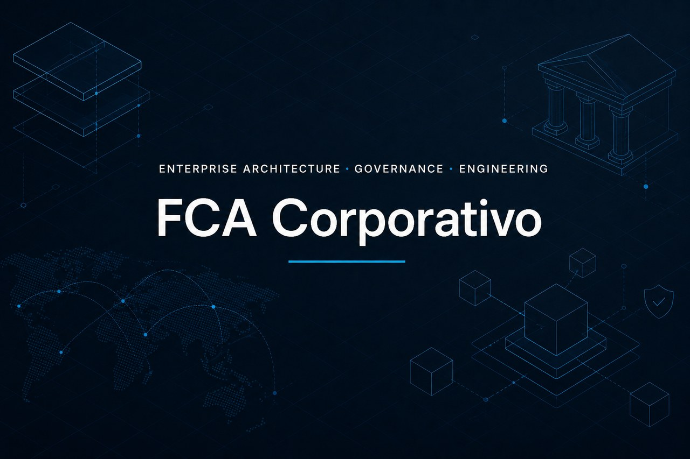
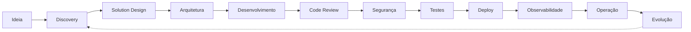
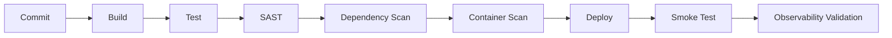
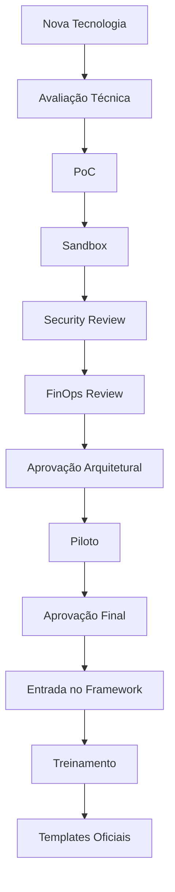

<p align="center">
  
</p>

# Framework Corporativo de Arquitetura de Software (FCA)

**Plataforma evolutiva para times internos e fornecedores**

| Atributo | Valor |
|----------|-------|
| **Sigla** | FCA / CEF (Corporate Engineering Framework) |
| **Versão do documento** | 1.0 |
| **Status** | Em definição |
| **Licença** | [MIT](LICENSE) |

---

## Sumário

- [Visão geral](#visão-geral)
- [Objetivos estratégicos](#objetivos-estratégicos)
- [Público-alvo](#público-alvo)
- [Estrutura do framework](#estrutura-do-framework)
- [1. Princípios de Engenharia](#1-princípios-de-engenharia)
- [2. Arquitetura Corporativa](#2-arquitetura-corporativa)
- [3. Catálogo Tecnológico](#3-catálogo-tecnológico)
- [4. SDLC Corporativo](#4-sdlc-corporativo)
- [5. IA no Ciclo de Desenvolvimento](#5-ia-no-ciclo-de-desenvolvimento)
- [6. Segurança e Compliance](#6-segurança-e-compliance)
- [7. Observabilidade e Operação](#7-observabilidade-e-operação)
- [8. Governança de APIs e Dados](#8-governança-de-apis-e-dados)
- [9. Plataforma DevSecOps](#9-plataforma-devsecops)
- [10. Framework de Qualidade](#10-framework-de-qualidade)
- [11. Framework de Custos (FinOps)](#11-framework-de-custos-finops)
- [12. Framework de Escalabilidade](#12-framework-de-escalabilidade)
- [13. Gestão de Legado](#13-gestão-de-legado)
- [14. Framework de Documentação](#14-framework-de-documentação)
- [15. Framework de Evolução Tecnológica](#15-framework-de-evolução-tecnológica)
- [16. Scorecards e Auditoria](#16-scorecards-e-auditoria)
- [17. Portal Corporativo de Engenharia](#17-portal-corporativo-de-engenharia)
- [Estrutura organizacional recomendada](#estrutura-organizacional-recomendada)
- [Modelo de maturidade](#modelo-de-maturidade)
- [Evolução futura](#evolução-futura)
- [Nomenclatura do framework](#nomenclatura-do-framework)
- [Resultado esperado](#resultado-esperado)

---

## Visão geral

O **Framework Corporativo de Arquitetura de Software (FCA)** estabelece um modelo único de engenharia corporativa — um *sistema operacional de engenharia* da organização — que unifica padrões, processos, tecnologias e governança para times internos e fornecedores externos.

O framework não é apenas um conjunto de documentos: é uma **plataforma evolutiva** que codifica conhecimento, automatiza boas práticas e permite evolução controlada com novas tecnologias e inteligência artificial.

```mermaid
flowchart TB
    subgraph FCA["Framework Corporativo de Arquitetura"]
        P[Princípios de Engenharia]
        A[Arquitetura Corporativa]
        C[Catálogo Tecnológico]
        S[SDLC Corporativo]
        I[IA no Desenvolvimento]
        G[Governança e Compliance]
        D[DevSecOps e Plataforma]
        Q[Qualidade e Observabilidade]
        F[FinOps e Escalabilidade]
        E[Evolução Tecnológica]
        SC[Scorecards e Auditoria]
        PO[Portal de Engenharia]
    end

    P --> A
    A --> C
    C --> S
    S --> I
    I --> G
    G --> D
    D --> Q
    Q --> F
    F --> E
    E --> SC
    SC --> PO
    PO -.->|feedback contínuo| P
```



---

## Objetivos estratégicos

| Objetivo | Descrição |
|----------|-----------|
| **Padronização** | Unificar desenvolvimento entre times internos e fornecedores |
| **Redução de dívida técnica** | Estabelecer padrões que previnem acúmulo de débito arquitetural |
| **Segurança e governança** | Incorporar controles de segurança e compliance desde o design |
| **Qualidade e previsibilidade** | Definir gates, métricas e critérios objetivos de entrega |
| **Onboarding acelerado** | Reduzir tempo de integração de novos desenvolvedores e parceiros |
| **Velocidade de entrega** | Oferecer golden paths, templates e automação de rotinas |
| **Compliance arquitetural** | Garantir aderência a padrões aprovados em todos os projetos |
| **Evolução contínua** | Permitir incorporação controlada de novas tecnologias e IA |

---

## Público-alvo

| Papel | Como utiliza o framework |
|-------|--------------------------|
| **Arquitetos corporativos** | Definem e evoluem padrões, aprovam exceções e conduzem o Technology Evolution Board |
| **Times de produto e engenharia** | Seguem golden paths, SDLC e catálogo tecnológico no dia a dia |
| **Fornecedores externos** | Adotam os mesmos padrões, pipelines e critérios de qualidade |
| **Platform Engineering / SRE** | Operam a plataforma, templates, observabilidade e runbooks |
| **Segurança e compliance** | Validam gates de segurança, LGPD e frameworks regulatórios |
| **FinOps** | Monitoram custos, aprovam estimativas e otimizam recursos |
| **Liderança técnica** | Acompanham scorecards, maturidade e evolução do framework |

---

## Estrutura do framework

O FCA é organizado em **17 domínios** interdependentes:

```
Corporate Engineering Framework (CEF)
│
├──  1. Princípios de Engenharia
├──  2. Arquitetura Corporativa
├──  3. Catálogo Tecnológico
├──  4. SDLC Corporativo
├──  5. IA no Ciclo de Desenvolvimento
├──  6. Segurança e Compliance
├──  7. Observabilidade e Operação
├──  8. Governança de APIs e Dados
├──  9. Plataforma DevSecOps
├── 10. Framework de Qualidade
├── 11. Framework de Custos (FinOps)
├── 12. Framework de Escalabilidade
├── 13. Gestão de Legado
├── 14. Framework de Documentação
├── 15. Framework de Evolução Tecnológica
├── 16. Scorecards e Auditoria
└── 17. Portal Corporativo de Engenharia
```

---

## 1. Princípios de Engenharia

Define os **pilares obrigatórios** que orientam todas as decisões técnicas da organização. Nenhum projeto deve violar estes princípios sem aprovação formal de exceção arquitetural.

| Pilar | Objetivo |
|-------|----------|
| **Security First** | Segurança incorporada desde o design, não como etapa posterior |
| **Cloud Native** | Soluções preparadas para nuvem, containers e escalabilidade horizontal |
| **API First** | Integrações e funcionalidades expostas via APIs bem definidas |
| **Observability by Default** | Logs estruturados, métricas e tracing obrigatórios em todos os serviços |
| **AI Assisted Engineering** | IA integrada ao SDLC com guardrails e governança |
| **Reuse Before Create** | Priorizar componentes, bibliotecas e serviços existentes |
| **Performance by Design** | Requisitos de performance definidos na arquitetura, não apenas em testes |
| **FinOps Awareness** | Custos monitorados e otimizados continuamente |
| **Zero Trust** | Nenhum acesso implícito; autenticação e autorização em todas as camadas |

---

## 2. Arquitetura Corporativa

Estabelece os **padrões oficiais** de arquitetura, stack tecnológica e decisões de design aprovadas pela organização.

### Arquiteturas permitidas por cenário

| Cenário | Arquitetura recomendada |
|---------|-------------------------|
| E-commerce | Microservices |
| Backoffice | Modular Monolith |
| Integração | Event Driven |
| IA Generativa | RAG + LLM |
| Analytics | Lakehouse |
| Tempo real | Streaming Architecture |

### Padrões oficiais — Backend

| Tipo | Tecnologias |
|------|-------------|
| Java | Spring Boot |
| .NET | ASP.NET Core |
| Node.js | NestJS |
| Python | FastAPI |
| APIs | REST + AsyncAPI |
| Eventos | Apache Kafka |
| Autenticação | OAuth 2.0 + OIDC |

### Padrões oficiais — Frontend

| Tipo | Tecnologia |
|------|------------|
| Web | React |
| Mobile | Flutter |
| Design System | Design Tokens + Component Library |

### Padrões oficiais — Cloud e infraestrutura

| Categoria | Padrão |
|-----------|--------|
| Cloud principal | Google Cloud Platform (GCP) |
| Containers | Kubernetes |
| Infraestrutura como código | Terraform |
| CI/CD | GitHub Actions / GitLab CI |
| Observabilidade | OpenTelemetry |

---

## 3. Catálogo Tecnológico

Catálogo oficial de tecnologias com **status de aprovação** definido pelo Technology Evolution Board. Toda tecnologia utilizada em produção deve constar neste catálogo.

### Status tecnológico

| Status | Significado | Ação |
|--------|-------------|------|
| **Approved** | Aprovada para uso | Pode ser utilizada em projetos |
| **Recommended** | Preferencial | Deve ser a escolha padrão em novos projetos |
| **Deprecated** | Em descontinuação | Evitar em novos projetos; planejar migração |
| **Forbidden** | Proibida | Uso não permitido em nenhum ambiente |
| **Experimental** | Em validação | Apenas em sandbox e PoCs aprovados |

### Exemplo de catálogo

| Tecnologia | Status |
|------------|--------|
| Java 21 | Recommended |
| Spring Boot 3 | Recommended |
| .NET 9 | Recommended |
| ASP.NET Core | Recommended |
| AngularJS | Forbidden |
| MongoDB | Approved |
| Redis | Recommended |
| Apache Cassandra | Experimental |

---

## 4. SDLC Corporativo

Padroniza o **ciclo de vida completo** do desenvolvimento de software, desde a concepção até a operação e evolução contínua.

### Etapas do ciclo



### Gates obrigatórios

Cada gate representa um **ponto de controle** que deve ser aprovado antes de avançar para a próxima etapa.

| Gate | Critério de aprovação |
|------|----------------------|
| **Arquitetura** | Aprovação formal do comitê de arquitetura (ADR registrado) |
| **Segurança** | SAST e DAST executados sem vulnerabilidades críticas |
| **Performance** | Teste de carga com resultados dentro do SLA definido |
| **Custos** | Estimativa FinOps aprovada e dentro do orçamento |
| **Qualidade** | Cobertura de testes acima do mínimo estabelecido |
| **Observabilidade** | Logs, métricas e dashboards configurados e validados |

---

## 5. IA no Ciclo de Desenvolvimento

A inteligência artificial é um **pilar estratégico** do framework moderno, integrada ao SDLC com governança, rastreabilidade e aprovação humana.

### AI SDLC Framework — Pontos de atuação

| Etapa | Uso da IA |
|-------|-----------|
| Discovery | Refinamento automático de requisitos e user stories |
| Arquitetura | Sugestões arquiteturais baseadas em padrões corporativos |
| Desenvolvimento | Pair programming assistido por IA |
| Testes | Geração automática de casos de teste |
| Segurança | Detecção proativa de vulnerabilidades |
| Operação | Root Cause Analysis (RCA) automatizado |
| FinOps | Otimização de custos e identificação de desperdício |
| Documentação | Geração automática de ADRs, runbooks e documentação de API |

### Guardrails de IA

| Regra | Objetivo |
|-------|----------|
| Não enviar PII para LLMs públicas | Compliance com LGPD e políticas de privacidade |
| Prompt versionado | Auditabilidade e reprodutibilidade |
| Respostas rastreáveis | Governança e accountability |
| Model Registry | Controle centralizado de modelos e versões |
| Human Approval | Aprovação humana obrigatória para decisões críticas |

---

## 6. Segurança e Compliance

Abordagem **Security by Design**: controles de segurança são requisitos obrigatórios, não opcionais.

### Controles obrigatórios

| Item | Exemplo / Ferramenta |
|------|----------------------|
| Secrets Manager | HashiCorp Vault |
| IAM centralizado | OAuth 2.0 / OIDC |
| Criptografia | AES-256 em repouso e em trânsito |
| API Gateway | Rate limiting e autenticação |
| WAF | Proteção contra ataques web |
| SAST | SonarQube |
| DAST | OWASP ZAP |

### Frameworks de referência

| Framework | Aplicação |
|-----------|-----------|
| OWASP ASVS | Segurança de aplicações |
| LGPD | Proteção de dados pessoais |
| ISO 27001 | Gestão de segurança da informação |
| Zero Trust | Modelo de acesso corporativo |

---

## 7. Observabilidade e Operação

Padrão corporativo que garante **visibilidade completa** sobre o comportamento dos sistemas em produção.

### Requisitos obrigatórios

| Item | Obrigatório |
|------|-------------|
| Structured Logs | Sim |
| Correlation ID | Sim |
| Distributed Tracing | Sim |
| Dashboards | Sim |
| Alertas | Sim |
| SLO / SLA | Sim |

### Stack recomendada

| Categoria | Ferramenta |
|-----------|------------|
| Logs | ELK Stack |
| Métricas | Prometheus |
| Tracing | Jaeger |
| Dashboards | Grafana |

---

## 8. Governança de APIs e Dados

### Governança de APIs

| Regra | Padrão |
|-------|--------|
| Versionamento | Prefixo `/v1`, `/v2` na URL |
| OpenAPI | Especificação obrigatória para APIs REST |
| AsyncAPI | Especificação obrigatória para eventos |
| API Catalog | Registro centralizado no portal corporativo |
| Rate Limit | Obrigatório em todas as APIs expostas |

### Governança de dados

| Item | Objetivo |
|------|----------|
| Data Catalog | Descoberta e catalogação de datasets |
| Data Lineage | Rastreabilidade de origem e transformações |
| Data Classification | Classificação por nível de sensibilidade |
| Retention Policy | Políticas de retenção para compliance |

---

## 9. Plataforma DevSecOps

Define o **pipeline oficial** de entrega contínua com segurança integrada em cada etapa.

### Pipeline oficial



### Controles obrigatórios

| Item | Obrigatório |
|------|-------------|
| Branch Protection | Sim |
| Pull Request Review | Sim |
| Secrets Scan | Sim |
| SBOM (Software Bill of Materials) | Sim |
| Assinatura de artefato | Sim |

---

## 10. Framework de Qualidade

Estabelece **quality gates** objetivos e tipos de teste obrigatórios para todos os projetos.

### Quality gates

| Métrica | Meta |
|---------|------|
| Cobertura de testes | > 80% |
| Vulnerabilidades críticas | 0 |
| Code smells | Controlado (dentro do limite SonarQube) |
| MTTR (Mean Time to Recovery) | Definido por serviço |
| Performance | Dentro do SLA acordado |

### Tipos de teste obrigatórios

| Tipo | Obrigatório |
|------|-------------|
| Unitário | Sim |
| Integração | Sim |
| Contrato | Sim |
| Performance | Sim |
| Segurança | Sim |

---

## 11. Framework de Custos (FinOps)

Engenharia orientada a custo: cada decisão técnica considera o **impacto financeiro**.

### Métricas de acompanhamento

| Métrica | Objetivo |
|---------|----------|
| Custo por API | Controle granular de gastos por endpoint |
| Custo por cliente | Análise de rentabilidade por segmento |
| Idle Resources | Identificação e redução de recursos ociosos |
| Uso de IA | Controle de tokens e custo por modelo |

### Políticas corporativas

| Política | Requisito |
|----------|-----------|
| Auto-scaling | Obrigatório em ambientes de produção |
| Resource limits | Limites de CPU e memória definidos |
| Ambientes ociosos | Shutdown automático fora do horário comercial |

---

## 12. Framework de Escalabilidade

Define **estratégias e patterns** oficiais para lidar com crescimento de carga e picos de demanda.

### Estratégias por necessidade

| Necessidade | Estratégia |
|-------------|------------|
| Black Friday / picos sazonais | CDN + Cache |
| Alta concorrência | Horizontal scaling |
| Resiliência | Circuit Breaker |
| Picos de tráfego | Queue buffering |

### Patterns oficiais

| Pattern | Uso recomendado |
|---------|-----------------|
| CQRS | Cenários com alta proporção de leitura |
| Saga | Transações distribuídas |
| Cache Aside | Otimização de performance |
| Bulkhead | Isolamento de falhas entre componentes |

---

## 13. Gestão de Legado

Estratégia corporativa para **modernização gradual** de sistemas legados sem interrupção de negócio.

| Cenário | Estratégia |
|---------|------------|
| Monólito crítico | Modularização incremental |
| Sistema antigo | Strangler Fig Pattern |
| Alto acoplamento | Anti-corruption Layer |

---

## 14. Framework de Documentação

Toda decisão técnica e operacional deve ser **documentada de forma padronizada e rastreável**.

### Documentos obrigatórios

| Documento | Formato / Ferramenta |
|-----------|----------------------|
| ADR (Architecture Decision Record) | Markdown |
| Diagramas de arquitetura | Mermaid |
| Especificação de APIs | OpenAPI |
| Especificação de eventos | AsyncAPI |
| Runbooks operacionais | Wiki corporativa |

---

## 15. Framework de Evolução Tecnológica

Mecanismo que mantém o framework **vivo e atualizado**, permitindo incorporação controlada de novas tecnologias.

### Technology Evolution Board

Processo formal para avaliação e adoção de novas tecnologias:



### Exemplo: adoção de MCP Servers

```
MCP Servers
    ↓
Sandbox
    ↓
Piloto interno
    ↓
Governança
    ↓
Catálogo oficial
    ↓
Treinamento
    ↓
Templates oficiais
```

---

## 16. Scorecards e Auditoria

Sistema de **avaliação contínua** da conformidade dos projetos com o framework.

### Engineering Score — Composição

| Indicador | Peso |
|-----------|------|
| Segurança | 25% |
| Performance | 20% |
| Observabilidade | 15% |
| Qualidade | 20% |
| Custos (FinOps) | 10% |
| Documentação | 10% |

### Níveis de conformidade

| Score | Status | Significado |
|-------|--------|-------------|
| 90 – 100 | **Gold** | Excelência em engenharia |
| 75 – 89 | **Silver** | Conformidade com melhorias pontuais |
| 60 – 74 | **Bronze** | Conformidade mínima; plano de ação necessário |
| < 60 | **Não conforme** | Ação corretiva obrigatória |

---

## 17. Portal Corporativo de Engenharia

O framework materializa-se como um **produto interno** acessível a todos os times.

### Áreas do portal

| Área | Conteúdo |
|------|----------|
| **Templates** | Boilerplates e scaffolds oficiais |
| **Arquiteturas** | Diagramas e referências arquiteturais |
| **Golden Paths** | Fluxos padronizados de criação de projetos |
| **Scorecards** | Dashboards de auditoria e conformidade |
| **Catálogo Tech** | Tecnologias aprovadas e seus status |
| **AI Hub** | Prompts, agentes e ferramentas de IA corporativas |
| **DevEx** | Guias de experiência do desenvolvedor |
| **Runbooks** | Procedimentos operacionais |

### Golden Paths

Fluxos automatizados que encapsulam todas as boas práticas do framework. Exemplo: *"Criar microserviço Java"*.

Ao acionar um golden path, o portal provisiona automaticamente:

- Repositório com estrutura padrão
- Pipeline CI/CD completo
- Configuração de observabilidade (logs, métricas, tracing)
- Controles de segurança (SAST, secrets scan)
- Infraestrutura como código (Terraform)
- Helm charts para deploy em Kubernetes
- Dashboards de monitoramento
- Quality gates configurados
- Templates de testes
- Documentação inicial (ADR, OpenAPI)
- IA configurada com guardrails corporativos

---

## Estrutura organizacional recomendada

| Time | Responsabilidade |
|------|------------------|
| **Enterprise Architecture** | Estratégia arquitetural e padrões corporativos |
| **Platform Engineering** | Plataforma interna, golden paths e templates |
| **DevSecOps** | Pipelines, segurança e automação de entrega |
| **SRE** | Operação, observabilidade e confiabilidade |
| **AI Engineering** | IA corporativa, modelos e guardrails |
| **FinOps** | Gestão e otimização de custos em nuvem |
| **Tech Governance** | Auditoria, scorecards e conformidade |

---

## Modelo de maturidade

O framework define **5 níveis de maturidade** para orientar a evolução da organização:

| Nível | Situação | Características |
|-------|----------|-----------------|
| **1** | Sem padrão | Desenvolvimento ad hoc, sem governança |
| **2** | Padrões básicos | Documentação e convenções iniciais |
| **3** | Governança definida | SDLC, gates e catálogo tecnológico ativos |
| **4** | Plataforma automatizada | Golden paths, portal e automação end-to-end |
| **5** | Engenharia orientada por IA | IA integrada ao SDLC com governança madura |

---

## Evolução futura

O framework deve evoluir continuamente para incorporar tendências emergentes:

| Horizonte | Capacidades |
|-----------|-------------|
| **Hoje** | APIs, microservices, DevSecOps, observabilidade |
| **Amanhã** | AI Native Architecture, SDLC autônomo, AI Agents |
| **Futuro** | Self-healing systems, Internal Developer Platforms, LLM Governance, Agentic Workflows |

---

## Nomenclatura do framework

Propostas de nome oficial para o framework:

| Nome | Conceito |
|------|----------|
| **CEF** | Corporate Engineering Framework |
| **OneEngineering** | Engenharia unificada |
| **NovaStack** | Plataforma evolutiva |
| **Atlas Engineering** | Governança global |
| **Orion Platform** | Engenharia escalável |
| **Nexus Framework** | Convergência tecnológica |

---

## Resultado esperado

Quando o framework atingir maturidade, a organização terá:

- Engenharia padronizada entre todos os times e fornecedores
- Menos retrabalho e incidentes em produção
- Menor custo operacional com FinOps ativo
- Maior velocidade de entrega via golden paths e automação
- Qualidade mensurável com scorecards objetivos
- Governança real com compliance arquitetural
- IA integrada ao SDLC com guardrails corporativos
- Evolução tecnológica controlada e auditável
- Escalabilidade corporativa preparada para picos de demanda

> **Princípio fundamental:** o conhecimento deixa de residir nas pessoas e passa a estar codificado na **plataforma corporativa de engenharia** — tornando a organização resiliente a turnover, escalável e previsível.

---

## Contribuição

Este documento é mantido como referência viva. Propostas de evolução devem seguir o processo do [Technology Evolution Board](#15-framework-de-evolução-tecnológica).

Para contribuir com melhorias neste repositório, abra uma issue ou pull request descrevendo a mudança proposta e seu impacto nos domínios do framework.
